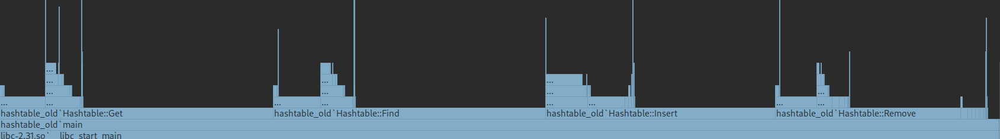

# Hashtable

Хэш-таблица `{строка: число}` с некоторыми оптимизациями.

## Тестирование

Для тестирования таблицы был взят набор из `466551` слов.

Сначала программа проходит юнит-тесты, с помощью которых проверяется корректность работы всех методов.

Далее с этим же набором `TEST_ITERATIONS` раз повторяются те же действия. На этом этапе приходят уведомления только об ошибках.

## Шаги оптимизации

### Без оптимизации

Обычная таблица с полиномиальной хэш-функцией. Работает не хорошо, но и не ужасно:

```
Running stress test...
Stress test done!
Total run time: 66.0477
```

Попробуем изучить отчёт профилировщика:




Сразу бросаются в глаза две проблемы: нахождение хэш-функции и сравнение строк занимают довольно большое время. Начнём с них.

### Оптимизация хэш-функции

Полиномиальная хэш-функция - не самый устойчивый к коллизиям, но зато один из самых быстрых способов хэширования.

Если посмотреть на получившийся ассемблерный код, то можно увидеть несколько проблем:

1. Частое обращение к стеку
2. Лишние операции, которых можно было бы избежать
3. Вызов методов `begin` и `end` у `string_view`

Заменим реализацию метода на `C++` ассемблерной вставкой, стараясь избежать перечисленных выше проблем.

Итог: все операции происходят через регистры, упрощённая логика, вместо вызова методов мы берём нужные данные напрямую.

Наглядный итог:
```
Running stress test...
Stress test done!
Total run time: 57.944
```

Как мы видим, всего одна улучшенная функция, которая используется в каждом методе, ускоряет программу довольно хорошо.

### Оптимизация сравнения строк

Если верить профилировщику, то при сравнении строк как-то многовато рекурсивных вызовов. Напишем сравнение сами, снова воспользуемся ассемблерной вставкой.

Итог: реализация использует только регистры, простая логика.

Наглядный итог:
```
Running stress test...
Stress test done!
Total run time: 51.3218
```

Внезапно программа получила приличный рывок в скорости.

Следующий возможный шаг оптимизации этого пункта - векторные инструкции.

### Прочие оптимизации

В процессе работы над кодом была выявлена следующая проблема: кажый раз при увеличении таблицы мы снова аллоцировали память на ноды. 

Если же мы эти ноды просто будем передподвешивать, то получим приятный результат:
```
Running stress test...
Stress test done!
Total run time: 38.5385
```

### Пример для подражания

Когда-нибудь люди станут настолько умными, что смогут сразу писать код, который работает быстрее, чем код с оптимизация, но точно не сегодня.

`-O2`:
```
Running stress test...
Stress test done!
Total run time: 24.4506
```

`-O3`:
```
Running stress test...
Stress test done!
Total run time: 24.2896
```
